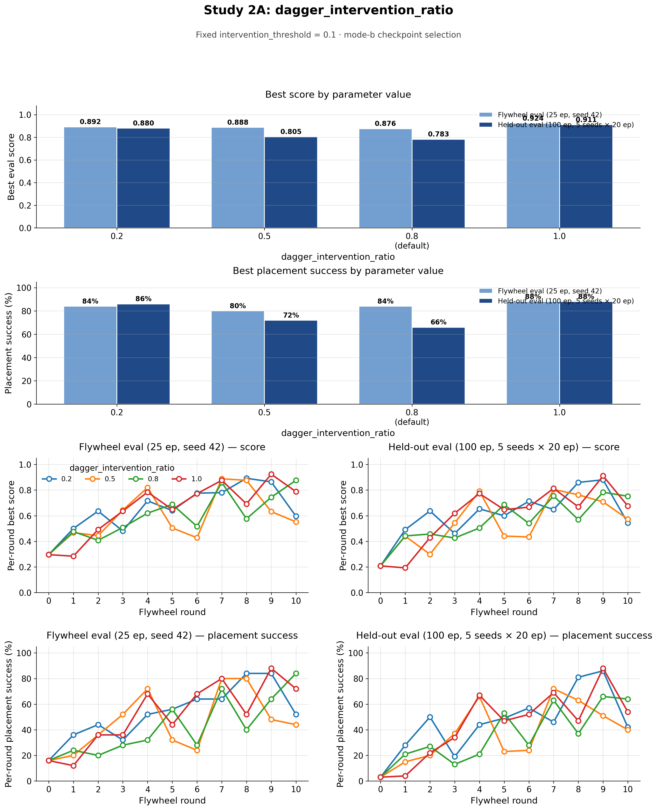

# Flywheel ablation results

Summary of flywheel parameter sweeps on Vast.ai RTX 4090 instances (2026-07-18). Each sweep holds all other flywheel settings at baseline and varies one parameter across four values. Every run is a full flywheel: expert collection → 10 DAgger rounds → train/eval.

All scores below come from the **held-out 100-episode re-evaluation** in `final_scores.json` (via `scripts/final_score.py`), not the 25-episode flywheel eval recorded in `metrics.json` during training.

Summary plots compare **both eval passes side by side**: light blue = flywheel (25 ep, seed 42), dark blue = held-out (100 ep, 5 seeds × 20 ep). Curve panels show per-round **score** and **placement success** for each eval type.

Raw metrics live under `results/flywheel/`; this folder holds the exported score-curve plots.

## Shared evaluation setup

| Setting | Value |
|---|---|
| Flywheel in-loop eval | 25 episodes, seed 42 |
| **Reported re-eval** | **100 episodes** (5 held-out seeds × 20 episodes) |
| Eval max steps | 1400 |
| Selection mode | mode-b (placement success rate first) |
| Eval metric version | 5 |
| DAgger rounds | 10 (rounds 0–10) |

During the flywheel, checkpoints were scored with 25 episodes. After each sweep, `final_score.py` re-scored every round's `best.pt` on 100 held-out episodes. The tables and summary plots use those larger-eval numbers.

---

## Study 1: `intervention_threshold`

**Fixed:** `dagger_intervention_ratio = 0.8` (config default)

L2 arm-action threshold for triggering expert takeover during DAgger rollouts. Lower values intervene more often.

| Threshold | Best score | Placement success | Best checkpoint | Final-round score |
|---:|---:|---:|---|---:|
| **0.05** | 0.765 | **69%** | round-004 | 0.569 |
| **0.10** *(default)* | **0.783** | 66% | round-009 | **0.752** |
| **0.20** | 0.720 | 54% | round-003 | 0.493 |
| **0.30** | 0.465 | 15% | round-009 | 0.415 |


Per-run held-out eval curves: [`intervention-threshold/`](intervention-threshold/)

### Findings

- **0.05 edges 0.10 on placement success** under mode-b (69% vs 66%), but **0.10 reaches the highest score** in the sweep (0.783) and retains 64% success at the final round.
- **0.05 peaked early** at round 4 (0.765, 69%) then collapsed to 29% placement by round 10 — more expert corrections did not sustain gains.
- **0.2 peaked at round 3** (0.720, 54%) then declined — similar mid-sweep regression.
- **0.3 remains clearly too lenient** — placement success never exceeded 15% on the held-out eval.

---

## Study 2: `dagger_intervention_ratio`

Share of expert-executed frames within DAgger training data (retrain rounds only). Lower values keep more policy-executed frames in the training mix.

Two sweeps were run at different fixed `intervention_threshold` values.

### Sweep A — fixed `intervention_threshold = 0.1` *(default threshold)*

Follow-up sweep combining the Study 1 winner (`intervention_threshold = 0.1`) with varying `dagger_intervention_ratio`.

| Ratio | Best score | Placement success | Best checkpoint | Final-round score |
|---:|---:|---:|---|---:|
| **0.2** | 0.880 | 86% | round-009 | 0.544 |
| **0.5** | 0.805 | 72% | round-007 | 0.573 |
| **0.8** *(default)* | 0.783 | 66% | round-009 | **0.752** |
| **1.0** | **0.911** | **88%** | round-009 | 0.676 |



Per-run held-out eval curves: [`dagger-intervention-ratio/`](dagger-intervention-ratio/) (`…-20260718-045251_…`)

#### Findings

- **Ratio 1.0 peaks highest** on held-out eval (0.911 score, 88% placement) — a reversal from Sweep B at threshold 0.2, where 1.0 was worst.
- **Ratio 0.2** also peaks strongly (0.880, 86%) but **regresses to 42% placement** by round 10.
- **Default ratio 0.8 is the most stable** — best checkpoint matches the Study 1 threshold-0.1 run (0.783, 66%) and **final round retains 64% placement** (0.752).
- Peak vs final-round tradeoff is sharp: the highest peak ratios (1.0, 0.2) both collapse by the final round.

### Sweep B — fixed `intervention_threshold = 0.2`

Original ratio sweep (run before Study 1 confirmed 0.1 as the better threshold).

| Ratio | Best score | Placement success | Best checkpoint | Final-round score |
|---:|---:|---:|---|---:|
| **0.2** | **0.874** | **79%** | round-009 | 0.813 |
| **0.5** | 0.708 | 56% | round-005 | 0.585 |
| **0.8** *(default)* | 0.720 | 54% | round-003 | 0.493 |
| **1.0** | 0.509 | 27% | round-005 | 0.455 |


Per-run held-out eval curves: [`dagger-intervention-ratio/`](dagger-intervention-ratio/) (`…-20260718-033707_…`)

#### Findings

- **Lower ratio wins** at threshold 0.2 — ratio 0.2 best (0.874, 79%), +0.154 score over default 0.8.
- **Expert-only data (1.0) is worst** at threshold 0.2 (0.509, 27%).
- Default 0.8 matches the Study 1 threshold-0.2 run (identical curves), confirming sweep controls.

---

## Recommendations

1. **Keep `intervention_threshold = 0.1`** — highest held-out score in Study 1 (0.783) and stable late-round performance (64% at round 10).
2. **At threshold 0.1, pick `dagger_intervention_ratio` by goal:**
   - **Peak checkpoint (round 9):** ratio **1.0** (0.911, 88%) or **0.2** (0.880, 86%)
   - **Final-round stability:** ratio **0.8** (default) — 0.752 score, 64% placement at round 10
3. **Do not assume lower ratio always wins** — the optimal ratio depends on fixed threshold and whether you optimize for peak or end-of-sweep performance.
4. **Investigate flywheel regression** — high-peak runs (ratios 0.2 and 1.0 at threshold 0.1) collapse by round 10. Consider early stopping on held-out eval at the best round.

---

## Folder contents

```
ablations/
├── README.md                          ← this file
├── intervention-threshold/
│   ├── summary.png                    ← bar + curve summary for threshold sweep
│   ├── …-0.05-final-score-curve.png
│   ├── …-0.1-final-score-curve.png
│   ├── …-0.2-final-score-curve.png
│   └── …-0.3-final-score-curve.png
└── dagger-intervention-ratio/
    ├── summary-threshold-0.1.png      ← summary for threshold=0.1 sweep
    ├── summary-threshold-0.2.png      ← summary for threshold=0.2 sweep
    ├── …-20260718-045251_…            ← per-run curves (threshold=0.1 sweep)
    └── …-20260718-033707_…            ← per-run curves (threshold=0.2 sweep)
```

## Source data

| Sweep | Fixed parameter | Results directory | Run date |
|---|---|---|---|
| intervention_threshold | `dagger_intervention_ratio = 0.8` | `results/flywheel/ablation-intervention-threshold-20260718-020039/` | 2026-07-18 |
| dagger_intervention_ratio | `intervention_threshold = 0.1` | `results/flywheel/ablation-dagger-intervention-ratio-20260718-045251/` | 2026-07-18 |
| dagger_intervention_ratio | `intervention_threshold = 0.2` | `results/flywheel/ablation-dagger-intervention-ratio-20260718-033707/` | 2026-07-18 |

Run protocols: [`docs/ablation/intervention-threshold.md`](../docs/ablation/intervention-threshold.md), [`docs/ablation/dagger-intervention-ratio.md`](../docs/ablation/dagger-intervention-ratio.md).

Held-out scoring: [`scripts/final_score.py`](../scripts/final_score.py) (default 100 episodes).
