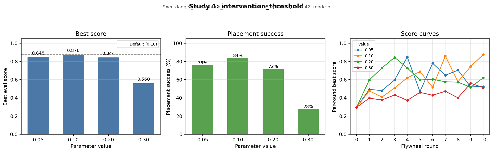
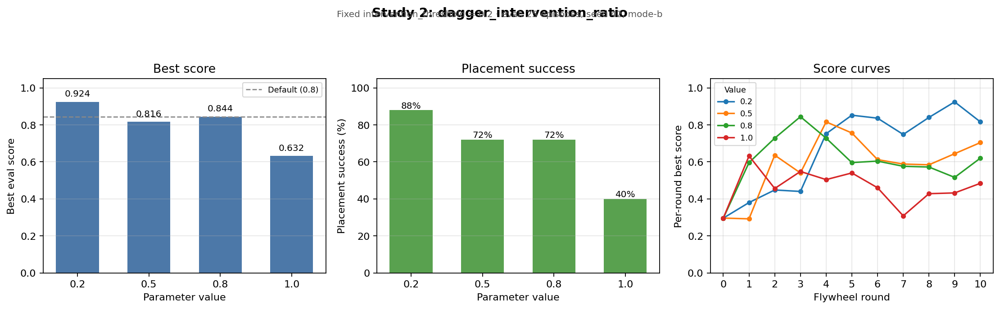
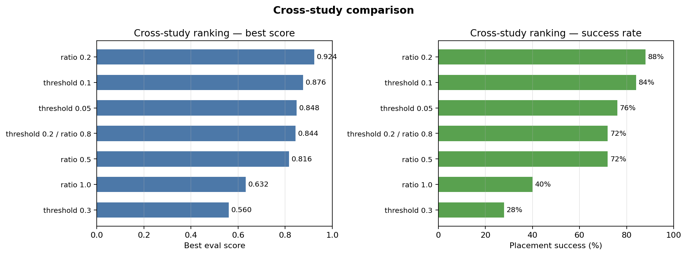

# Flywheel ablation results

Summary of two parameter sweeps run on a single Vast.ai RTX 4090 instance (2026-07-18). Each sweep holds all other flywheel settings at baseline and varies one parameter across four values. Every run is a full flywheel: expert collection → 10 DAgger rounds → train/eval.

Raw metrics live under `results/flywheel/`; this folder holds the exported score-curve plots.

## Shared evaluation setup

| Setting | Value |
|---|---|
| Eval episodes | 25 |
| Eval seed | 42 |
| Eval max steps | 1400 |
| Selection mode | mode-b (placement success rate first) |
| Eval metric version | 5 |
| DAgger rounds | 10 (rounds 0–10) |

---

## Study 1: `intervention_threshold`

**Fixed:** `dagger_intervention_ratio = 0.8` (config default)

L2 arm-action threshold for triggering expert takeover during DAgger rollouts. Lower values intervene more often.

| Threshold | Best score | Placement success | Best checkpoint | Final-round score |
|---:|---:|---:|---|---:|
| **0.05** | 0.848 | 76% | round-004 | 0.524 |
| **0.10** *(default)* | **0.876** | **84%** | round-010 | **0.876** |
| **0.20** | 0.844 | 72% | round-003 | 0.620 |
| **0.30** | 0.560 | 28% | round-009 | 0.512 |



Per-run held-out eval curves: [`intervention-threshold/`](intervention-threshold/)

### Findings

- **Default (0.1) is the best setting** in this sweep — 84% placement success and the only run that continued improving through the final round.
- **0.05** is a close second (76%) but peaked early at round 4 (0.848) and regressed afterward. More frequent expert corrections did not sustain gains.
- **0.2** also peaked early (round 3, 0.844) then declined — similar regression pattern to 0.05.
- **0.3 is clearly too lenient** — placement success never exceeded 28%. With too few expert corrections the policy fails to learn reliable placement.

---

## Study 2: `dagger_intervention_ratio`

**Fixed:** `intervention_threshold = 0.2`

Share of expert-executed frames within DAgger training data (retrain rounds only). Lower values keep more policy-executed frames in the training mix.

| Ratio | Best score | Placement success | Best checkpoint | Final-round score |
|---:|---:|---:|---|---:|
| **0.2** | **0.924** | **88%** | round-009 | 0.816 |
| **0.5** | 0.816 | 72% | round-004 | 0.704 |
| **0.8** *(default)* | 0.844 | 72% | round-003 | 0.620 |
| **1.0** | 0.632 | 40% | round-001 | 0.484 |



Per-run held-out eval curves: [`dagger-intervention-ratio/`](dagger-intervention-ratio/)

### Findings

- **Lower ratio wins decisively.** Ratio 0.2 achieved the best score across both studies (0.924, 88% success) — a +8 point score gain over the default 0.8.
- **Expert-only DAgger data (1.0) is worst** — peaked at round 1 (0.632) and never recovered. Training exclusively on expert-corrected frames hurts generalization.
- **Default 0.8 matches the intervention-threshold-0.2 run** (identical score curves), confirming the sweeps were controlled correctly.
- Most runs in this study peaked before the final round, suggesting **continued DAgger rounds may cause regression** when the training mix is suboptimal.

---

## Cross-study comparison

| Rank | Study | Parameter | Best score | Success |
|---:|---|---|---:|---:|
| 1 | dagger_intervention_ratio | 0.2 | **0.924** | **88%** |
| 2 | intervention_threshold | 0.1 | 0.876 | 84% |
| 3 | intervention_threshold | 0.05 | 0.848 | 76% |
| 4 | intervention_threshold / dagger ratio | 0.2 / 0.8 | 0.844 | 72% |
| 5 | dagger_intervention_ratio | 0.5 | 0.816 | 72% |
| 6 | dagger_intervention_ratio | 1.0 | 0.632 | 40% |
| 7 | intervention_threshold | 0.3 | 0.560 | 28% |



---

## Recommendations

1. **Keep `intervention_threshold = 0.1`** — validated as near-optimal; do not increase to 0.3.
2. **Lower `dagger_intervention_ratio` to ~0.2** — the largest single improvement found (+0.048 score vs default 0.8 at the same threshold). Worth a follow-up sweep around 0.1–0.3.
3. **Investigate flywheel regression** — several runs peak mid-sweep then decline. Consider early stopping on eval, checkpoint selection, or fewer DAgger rounds.
4. **Combine the winners** — a run with `intervention_threshold=0.1` and `dagger_intervention_ratio=0.2` is the logical next experiment.

---

## Folder contents

```
ablations/
├── README.md                          ← this file
├── cross-study-ranking.png            ← summary charts (all runs ranked)
├── intervention-threshold/
│   ├── summary.png                    ← bar + curve summary for threshold sweep
│   ├── …-0.05-final-score-curve.png
│   ├── …-0.1-final-score-curve.png
│   ├── …-0.2-final-score-curve.png
│   └── …-0.3-final-score-curve.png
└── dagger-intervention-ratio/
    ├── summary.png                    ← bar + curve summary for ratio sweep
    ├── …-0.2-final-score-curve.png
    ├── …-0.5-final-score-curve.png
    ├── …-0.8-final-score-curve.png
    └── …-1.0-final-score-curve.png
```

## Source data

| Sweep | Results directory | Run date |
|---|---|---|
| intervention_threshold | `results/flywheel/ablation-intervention-threshold-20260718-020039/` | 2026-07-18 |
| dagger_intervention_ratio | `results/flywheel/ablation-dagger-intervention-ratio-20260718-033707/` | 2026-07-18 |

Run protocols: [`docs/ablation/intervention-threshold.md`](../docs/ablation/intervention-threshold.md), [`docs/ablation/dagger-intervention-ratio.md`](../docs/ablation/dagger-intervention-ratio.md).
