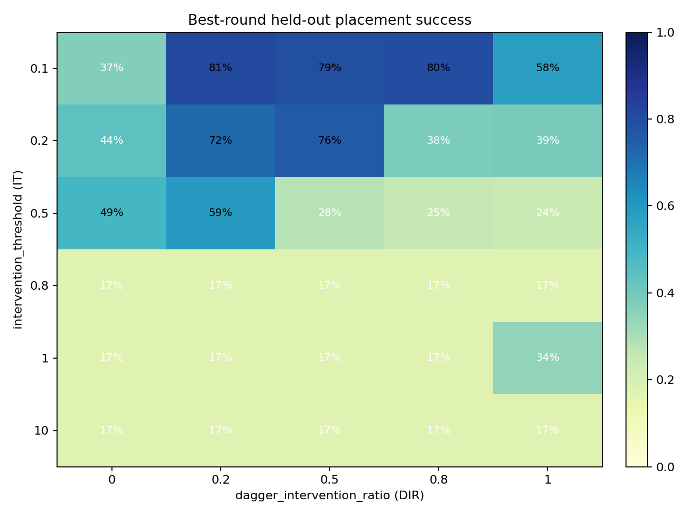
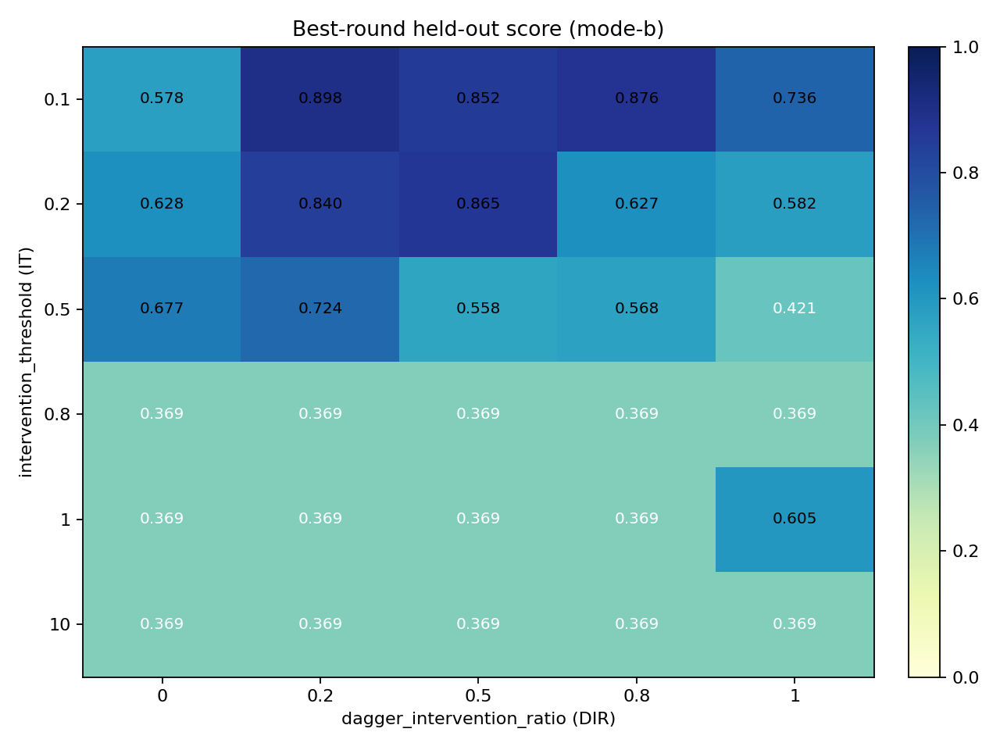
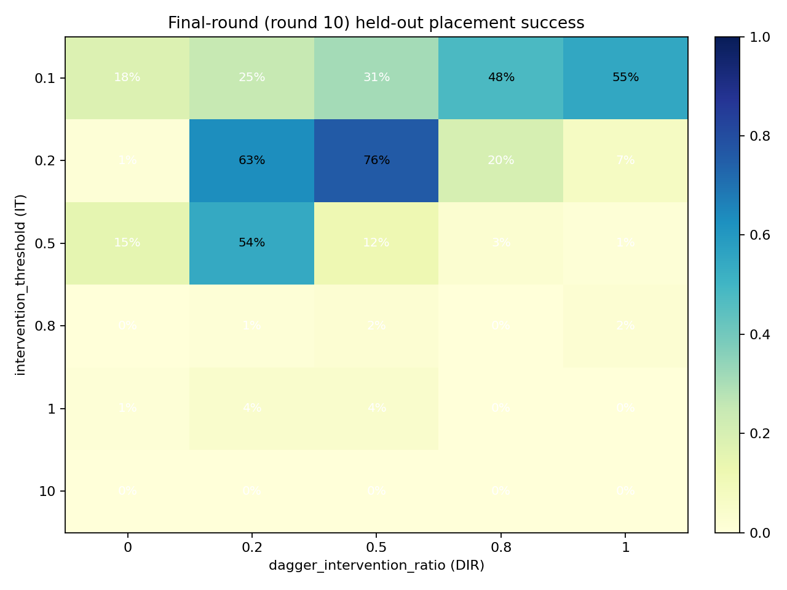
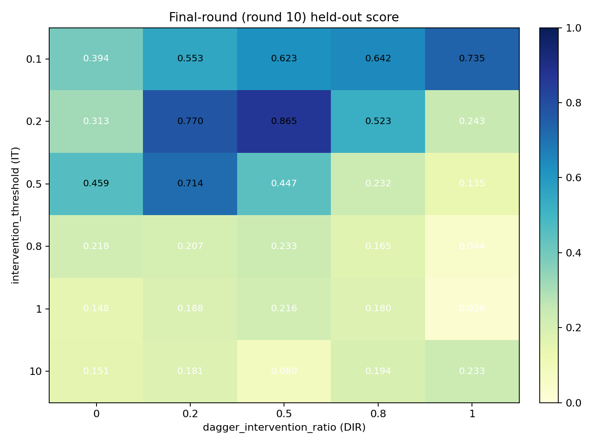
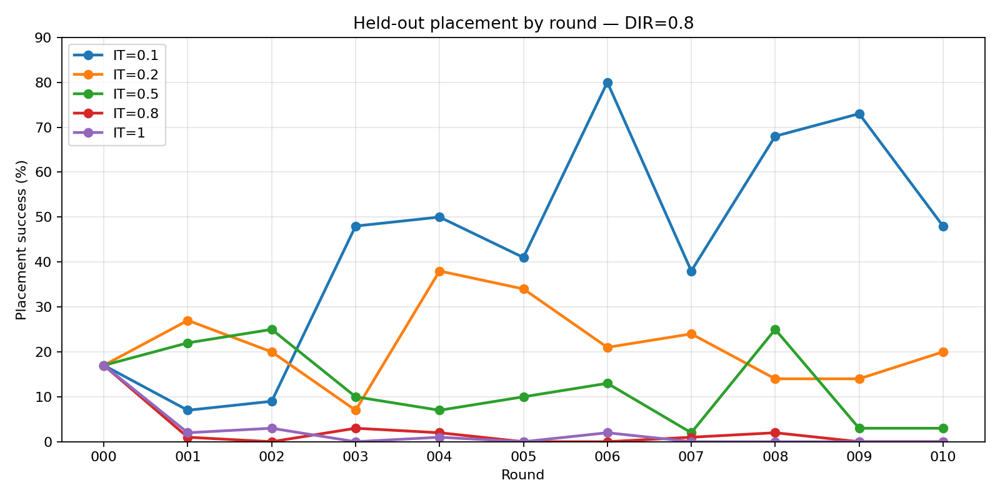
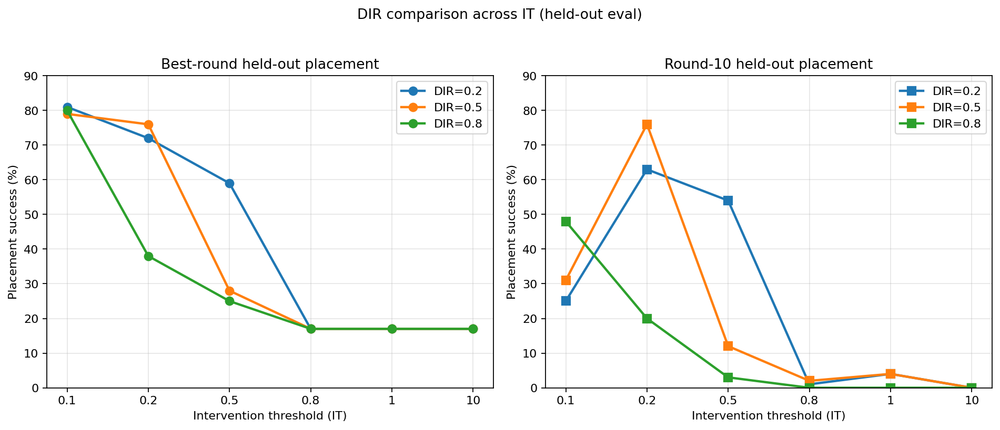
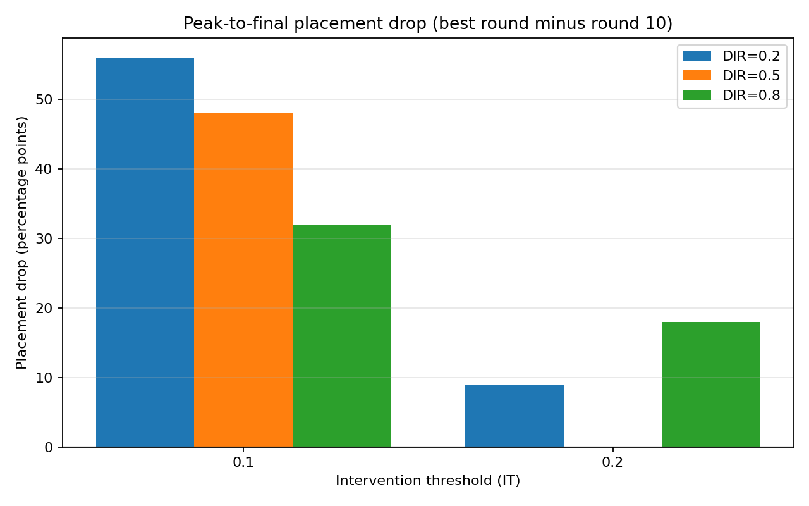
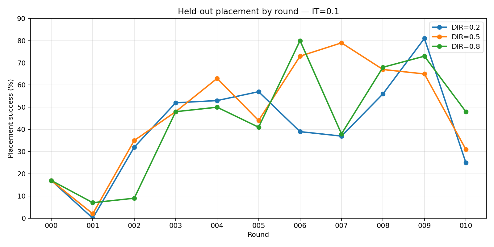
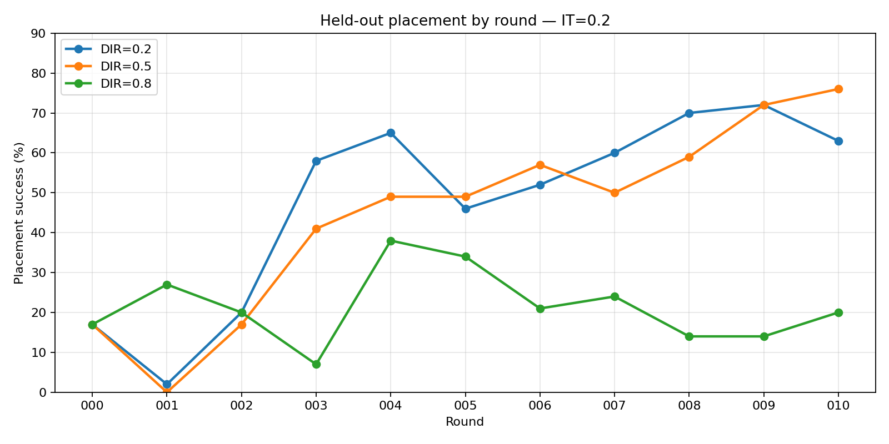

# Flywheel ablation: `intervention_threshold` × `dagger_intervention_ratio`

2D grid sweep on Vast.ai RTX 4090 (2026-07-18). Each cell is a full flywheel: expert collection → 10 DAgger rounds → train/eval.

All metrics below come from the **held-out 100-episode re-evaluation** in `final_scores.json` (via `scripts/final_score.py`), not the 25-episode flywheel eval recorded in `metrics.json` during training.

**Placement success rate** is the primary comparison metric (matching mode-b checkpoint selection). **Score** is reported as auxiliary context — useful for spotting regressions and comparing cells with similar placement.

Per-run curve PNGs compare **both eval passes side by side**: gray = flywheel (25 ep, seed 42), blue = held-out (100 ep, 5 seeds × 20 ep).

Raw metrics live under `results/flywheel/ablation-it-dir-20260718-183651/`; this folder holds exported plots only.

## Parameter grid

| Axis | YAML key | Values swept |
|---|---|---|
| **IT** (rows) | `intervention_threshold` | 0.1, 0.2, 0.5, 0.8, 1.0, 10.0 |
| **DIR** (columns) | `dagger_intervention_ratio` | 0.0, 0.2, 0.5, 0.8, 1.0 |

- **IT** — L2 arm-action threshold for triggering expert takeover during DAgger rollouts. Lower values intervene more often.
- **DIR** — share of expert-executed frames within DAgger training data (retrain rounds only). Lower values keep more policy-executed frames in the training mix.

30 cells total (6 × 5). All other flywheel settings match `configs/flywheel/default.yaml`.

## Shared evaluation setup

| Setting | Value |
|---|---|
| Flywheel in-loop eval | 25 episodes, seed 42 |
| **Reported re-eval** | **100 episodes** (5 held-out seeds × 20 episodes) |
| Eval max steps | 1400 |
| Selection mode | mode-b (placement success rate first) |
| Eval metric version | 5 |
| DAgger rounds | 10 (rounds 0–10) |

## Summary heatmaps









## IT focus: placement by round at DIR=0.8 (default)

At the config-default ratio, only **IT=0.1** sustains meaningful placement gains. Higher thresholds flatline near the round-0 baseline (~17%) within a few rounds.



Per-round placement (held-out, %):

| Round | 0.1 | 0.2 | 0.5 | 0.8 | 1.0 |
|---:|---:|---:|---:|---:|---:|
| 3 | 48 | 7 | 10 | 3 | 0 |
| 4 | 50 | **38** | 7 | 2 | 1 |
| 6 | **80** | 21 | 13 | 0 | 2 |
| 7 | 38 | 24 | 2 | 1 | 0 |
| 9 | 73 | 14 | 3 | 0 | 0 |
| 10 | **48** | 20 | 3 | 0 | 0 |

IT=0.1 peaks at round 6 (80%) and regresses to 48% by round 10 — the same peak-vs-final tradeoff seen in the DIR slices. IT=0.2 briefly reaches 38% (round 4) then stalls; IT ≥ 0.5 never escapes the baseline band.

## DIR focus: 0.2, 0.5, 0.8

These three ratios span the mixed-expert band between pure policy (DIR=0) and expert-heavy (DIR=1). They also bracket the config default (0.8) and the Study 2 sweep points (0.2, 0.5, 0.8).





### IT=0.1 — similar peaks, different late-round fate

| DIR | Peak placement | Peak round | Final placement | Drop (pp) | Score peak → final |
|---:|---:|---:|---:|---:|---|
| 0.2 | **81%** | 9 | 25% | **56** | 0.898 → 0.553 |
| 0.5 | 79% | 7 | 31% | 48 | 0.852 → 0.623 |
| 0.8 | 80% | 6 | **48%** | 32 | 0.876 → 0.642 |

All three peak near **80%**, but only DIR=0.8 retains meaningful placement by round 10. DIR=0.2 is the highest peak and the sharpest collapse (81% → 25% in one round).



Per-round placement (held-out, %):

| Round | 0.2 | 0.5 | 0.8 |
|---:|---:|---:|---:|
| 6 | 39 | 73 | **80** |
| 7 | 37 | **79** | 38 |
| 8 | 56 | 67 | 68 |
| 9 | **81** | 65 | 73 |
| 10 | 25 | 31 | **48** |

DIR=0.2 spikes at round 9 then falls; DIR=0.8 peaks earlier (round 6) but decays more slowly.

### IT=0.2 — optimal DIR shifts to 0.5

| DIR | Peak placement | Peak round | Final placement | Drop (pp) | Score peak → final |
|---:|---:|---:|---:|---:|---|
| 0.2 | 72% | 9 | 63% | 9 | 0.840 → 0.770 |
| 0.5 | **76%** | 10 | **76%** | **0** | **0.865 → 0.865** |
| 0.8 | 38% | 4 | 20% | 18 | 0.627 → 0.523 |

At IT=0.2 the ranking **inverts** vs IT=0.1: default DIR=0.8 becomes the worst of the three; **DIR=0.5 is the only cell with no peak-to-final regression**.



Per-round placement (held-out, %):

| Round | 0.2 | 0.5 | 0.8 |
|---:|---:|---:|---:|
| 4 | 58 | 41 | 7 |
| 7 | 60 | 50 | 24 |
| 9 | 72 | 72 | 14 |
| 10 | 63 | **76** | 20 |

DIR=0.8 peaks early (round 4, 38%) then stagnates; DIR=0.5 climbs steadily through round 10.

### IT ≥ 0.5 — DIR choice irrelevant

For DIR ∈ {0.2, 0.5, 0.8} and IT ≥ 0.5, all cells stay at the round-0 baseline (~17% peak, ≤4% final). No ratio in this band rescues a high threshold.

### Takeaways for DIR tuning

| Question | Answer |
|---|---|
| Best DIR at IT=0.1 for peak? | **0.2** (81%), with early stop ~round 9 |
| Best DIR at IT=0.1 for round 10? | **0.8** (48%) among {0.2, 0.5, 0.8}; DIR=1.0 beats all three (55%) |
| Best DIR at IT=0.2? | **0.5** on both peak and final (76%) |
| Safest mid-band default? | **IT=0.2, DIR=0.5** — no observed late collapse |
| Where default (IT=0.1, DIR=0.8) sits | Mid-pack on final round (48%); strong peak (80%) but not the best in either IT row |

Regenerate these plots: `uv run python scripts/plot_it_dir_ablation.py`.

## Full results

| IT | DIR | Best placement | Best score | Best checkpoint | Final-round placement | Final-round score |
|---:|---:|---:|---:|---|---:|---:|
| 0.1 | 0 | 37% | 0.578 | round-003 | 18% | 0.394 |
| 0.1 | 0.2 | **81%** | 0.898 | round-009 | 25% | 0.553 |
| 0.1 | 0.5 | 79% | 0.852 | round-007 | 31% | 0.623 |
| 0.1 | 0.8 | 80% | 0.876 | round-006 | 48% | 0.642 |
| 0.1 | 1 | 58% | 0.736 | round-007 | 55% | 0.735 |
| 0.2 | 0 | 44% | 0.628 | round-005 | 1% | 0.313 |
| 0.2 | 0.2 | 72% | 0.840 | round-009 | 63% | 0.770 |
| 0.2 | 0.5 | 76% | 0.865 | round-010 | **76%** | 0.865 |
| 0.2 | 0.8 | 38% | 0.627 | round-004 | 20% | 0.523 |
| 0.2 | 1 | 39% | 0.582 | round-004 | 7% | 0.243 |
| 0.5 | 0 | 49% | 0.677 | round-002 | 15% | 0.459 |
| 0.5 | 0.2 | 59% | 0.724 | round-008 | 54% | 0.714 |
| 0.5 | 0.5 | 28% | 0.558 | round-007 | 12% | 0.447 |
| 0.5 | 0.8 | 25% | 0.568 | round-008 | 3% | 0.232 |
| 0.5 | 1 | 24% | 0.421 | round-001 | 1% | 0.135 |
| 0.8 | 0 | 17% | 0.369 | round-000 | 0% | 0.218 |
| 0.8 | 0.2 | 17% | 0.369 | round-000 | 1% | 0.207 |
| 0.8 | 0.5 | 17% | 0.369 | round-000 | 2% | 0.233 |
| 0.8 | 0.8 | 17% | 0.369 | round-000 | 0% | 0.165 |
| 0.8 | 1 | 17% | 0.369 | round-000 | 2% | 0.044 |
| 1 | 0 | 17% | 0.369 | round-000 | 1% | 0.148 |
| 1 | 0.2 | 17% | 0.369 | round-000 | 4% | 0.188 |
| 1 | 0.5 | 17% | 0.369 | round-000 | 4% | 0.216 |
| 1 | 0.8 | 17% | 0.369 | round-000 | 0% | 0.180 |
| 1 | 1 | 34% | 0.605 | round-001 | 0% | 0.026 |
| 10 | 0 | 17% | 0.369 | round-000 | 0% | 0.151 |
| 10 | 0.2 | 17% | 0.369 | round-000 | 0% | 0.181 |
| 10 | 0.5 | 17% | 0.369 | round-000 | 0% | 0.080 |
| 10 | 0.8 | 17% | 0.369 | round-000 | 0% | 0.194 |
| 10 | 1 | 17% | 0.369 | round-000 | 0% | 0.233 |

## Findings

### Viable region is narrow: IT ∈ {0.1, 0.2}

All cells with **IT ≥ 0.5** stall near the round-0 baseline (≤17% placement; ~0.37 score). IT = 10.0 is effectively a no-intervention control across every DIR value.

Within IT = 0.1–0.2, placement depends strongly on DIR and on whether you optimize for **peak checkpoint** or **final-round stability**.

### Peak vs final-round tradeoff persists

| Goal | Best cell | Peak (best round) | Final round (round 10) |
|---|---|---:|---:|
| Highest peak placement | IT=0.1, DIR=0.2 | **81%** / 0.898 | 25% / 0.553 |
| Best final-round placement | IT=0.2, DIR=0.5 | 76% / 0.865 | **76%** / 0.865 |
| Default config | IT=0.1, DIR=0.8 | 80% / 0.876 | 48% / 0.642 |
| Stable late performance at IT=0.1 | IT=0.1, DIR=1.0 | 58% / 0.736 | 55% / 0.735 |

High-peak cells at IT=0.1 (DIR=0.2, 0.5, 0.8) all **regress sharply in placement** by round 10 — the same pattern seen in the earlier 1D ratio sweeps. Score drops track the placement collapse but are secondary to the placement regression itself.

### DIR=0.0 is weak at low IT

Pure policy rollouts (DIR=0) underperform mixed expert/policy data at IT=0.1–0.2. At IT=0.1, DIR=0 reaches only 37% peak / 18% final placement (0.578 / 0.394 score) vs 80% / 48% for the default DIR=0.8 (0.876 / 0.642 score).

### Interaction effects are real

The optimal DIR depends on IT:

- At **IT=0.1**, mid-to-high DIR (0.5–0.8) peaks highest on placement; DIR=1.0 is the most stable at the final round.
- At **IT=0.2**, **DIR=0.5** is best on both peak and final placement; default DIR=0.8 collapses to 20% final placement.
- At **IT ≥ 0.5**, DIR choice barely matters — all combinations fail on placement.

## Recommendations

1. **Keep IT in {0.1, 0.2}** — everything above 0.5 is non-viable on this task (≤17% placement).
2. **For end-of-sweep performance:** use **IT=0.2, DIR=0.5** (76% placement, 0.865 score at round 10).
3. **For peak checkpoint with early stopping:** use **IT=0.1, DIR=0.2** (81% placement, 0.898 score at round 9) — do not train through round 10 without re-eval (drops to 25% placement).
4. **For a conservative default close to config:** **IT=0.1, DIR=0.8** retains 48% final placement (0.642 score) — weaker than (0.2, 0.5) but better behaved than the high-peak DIR=0.2 cell at IT=0.1.
5. **Treat IT ≥ 0.5 and DIR=0.0** as negative controls, not tuning candidates.

## Per-run held-out eval curves

All 30 curve PNGs are in this folder. Naming: `ablation-it-dir-20260718-183651_abl-it{IT}-dir{DIR}-final-score-curve.png`.

Examples:

- [`…abl-it0p1-dir0p2…`](ablation-it-dir-20260718-183651_abl-it0p1-dir0p2-final-score-curve.png) — highest peak placement (IT=0.1, DIR=0.2)
- [`…abl-it0p2-dir0p5…`](ablation-it-dir-20260718-183651_abl-it0p2-dir0p5-final-score-curve.png) — best final-round placement (IT=0.2, DIR=0.5)
- [`…abl-it0p1-dir0p8…`](ablation-it-dir-20260718-183651_abl-it0p1-dir0p8-final-score-curve.png) — default config (IT=0.1, DIR=0.8)

## Folder contents

```
it-vs-dir/
├── README.md                          ← this file
├── summary-best-placement.png         ← heatmap: best-round placement (primary)
├── summary-best-score.png             ← heatmap: best-round score (auxiliary)
├── summary-final-placement.png        ← heatmap: round-10 placement (primary)
├── summary-final-score.png            ← heatmap: round-10 score (auxiliary)
├── summary-it-curves-dir0p8-placement.png  ← IT curves at default DIR=0.8
├── summary-dir-slices-placement.png   ← DIR 0.2/0.5/0.8 vs IT (peak + final)
├── summary-dir-regression-bars.png    ← peak-to-final drop for IT=0.1/0.2
├── summary-dir-curves-it0p1-placement.png
├── summary-dir-curves-it0p2-placement.png
└── ablation-it-dir-20260718-183651_abl-it*-dir*-final-score-curve.png  (30 files)
```

Training diagnostics (`plots/`, `final_scores_comparison.png`) and JSON metrics remain under `results/flywheel/ablation-it-dir-20260718-183651/`.

## Source data

| Grid | Results directory | Run date |
|---|---|---|
| IT × DIR (30 cells) | `results/flywheel/ablation-it-dir-20260718-183651/` | 2026-07-18 |

Held-out scoring: [`scripts/final_score.py`](../../scripts/final_score.py) (default 100 episodes).

Earlier 1D sweeps: [`../README.md`](../README.md).
